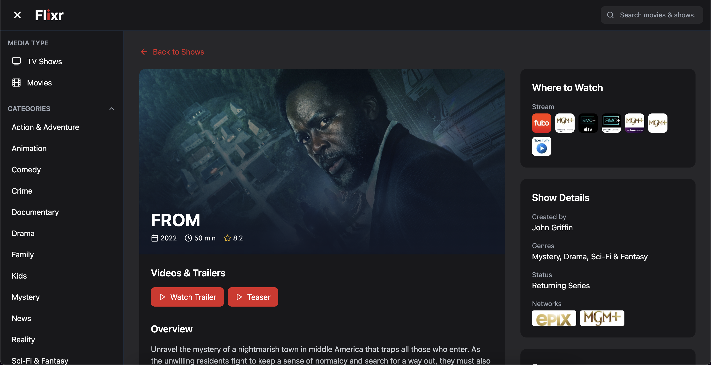

# Flixr 🎬

A modern web application built with React, TypeScript, and Tailwind CSS that helps users discover and explore movies and TV shows. 

## 🚀 Features

### Content Discovery
- Browse trending movies and TV shows
- Explore top-rated content
- View latest releases
- Character progress through seasons
- Filter content by various categories (popular, now playing, upcoming, etc.)

### 🔍 Search Functionality
- Universal search across movies and TV shows
- Real-time filtering between movies and TV shows
- Dynamic loading of search results

### 📝 Detailed Information
- Comprehensive show/movie details including:
  - Cast information
  - Trailers and videos
  - Release dates and ratings
  - Episode run times
  - Show seasons and episodes
  - Production networks

### 📺 Streaming Availability
- Shows where to watch content through:
  - Streaming services
  - Rental options
  - Purchase platforms
- Displays provider logos for easy recognition

### 💻 User Interface
- Clean, modern dark theme
- Responsive design for all devices
- Infinite scroll for content loading
- Dynamic filtering and sorting options
- Video player for trailers
- High-quality poster and backdrop images

## 🛠️ Built With
- React
- TypeScript
- Tailwind CSS
- TMDB API